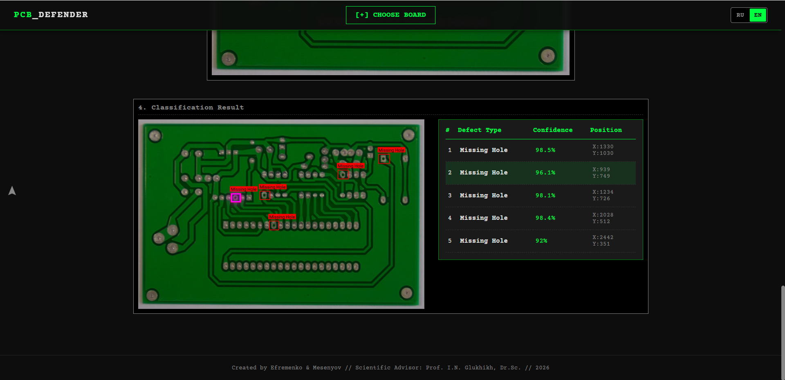

<div align="right">
  🌍 <strong>English</strong> | <a href="README_ru.md">🇷🇺 Русский</a>
</div>

🔍 Siamese Neural Network-Based Adaptive Approach for Open-Set Defect Detection in PCBs


Official repository for the paper: **"Siamese Neural Network-Based Adaptive Approach for Open-Set Defect Detection and Classification in Printed Circuit Boards"**.

This project provides an automated visual quality inspection (AOI) framework for Printed Circuit Boards (PCBs). It is specifically designed to detect manufacturing defects by comparing test images with a defect-free "Golden Template".

**Key Feature:** Unlike traditional object detectors limited to a closed-set paradigm, this system is capable of detecting **Out-of-Distribution (OOD) anomalies** (previously unknown defect types) without requiring complete model retraining, achieving an **OOD F1-Score of 83.2%**.

---

## 🖥️ System Interface


> **Interactive Analytical Dashboard:** The web-based UI provides end-to-end defect localization and metric classification. It highlights known defects with precise bounding boxes, displays real-time confidence scores computed via ArcFace latent distances, and explicitly tags novel OOD anomalies, ensuring highly interpretable results for AOI operators.

---

## 📊 Experimental Results (End-to-End OOD Evaluation)

The proposed framework was evaluated against state-of-the-art closed-set detectors (YOLOv8 family) and an open-world detector (ORE) on a custom validation dataset containing **fundamentally novel anomalies** (scratches, oxidation, contamination, etc.).

| Model / Method | Params (M) | Inference Speed (FPS) | Det Recall | OOD F1-Score |
| :--- | :---: | :---: | :---: | :---: |
| YOLOv8 Small | 11.14 | 50.6 | 0.2192 | 0.0917 |
| YOLOv8 Medium | 25.86 | 33.9 | 0.2466 | 0.0901 |
| YOLOv8 Large | 43.63 | 21.8 | 0.2192 | 0.1091 |
| YOLOv8 X-Large | 68.16 | 16.7 | 0.1507 | 0.0792 |
| ORE (CVPR 2021) | ~41.0 | 5.4 | 0.4030 | 0.2778 |
| **Proposed Method** | **7.63** | **35.4** | **0.9552** 🏆 | **0.8323** 🏆 |

> **Key Performance:** The system achieves **98.5% F1-Score on known defects** and maintains high efficiency with only **7.63M parameters**, satisfying real-time industrial requirements.

---

## 🛠 Architecture

The framework decouples the tasks of anomaly localization and metric classification into a lightweight two-stage pipeline:

### Stage 1: Anomaly Localization (Siamese U-Net)
Identifies structural deviations from the golden template using feature-level differential subtraction.
*   **Backbone:** Lightweight **MobileNetV3-Large**.
*   **Mechanism:** Shared-weight Siamese branches extract features at three hierarchical scales. Absolute differences ($D_i$) are fed into a decoder with skip-connections.
*   **Training:** Two-phase regimen using **BCE + Dice Loss** to ensure precise boundary delineation and mitigate class imbalance.

### Stage 2: Metric Classification (ProtoNet)
Classifies localized defects or rejects them as novel (OOD) anomalies.
*   **Backbone:** Secondary **MobileNetV3-Large** encoder.
*   **Strategy:** **Scale-recovery cropping** — defects are extracted from full-resolution images based on Stage 1 masks to preserve minute morphological details.
*   **Metric Learning:** Optimized via **ArcFace** loss to create highly discriminative latent clusters on a unit hypersphere.
*   **OOD Detection:** Uses an **adaptive thresholding strategy** ($3\sigma$ rule) with an analytically optimized global minimum threshold ($T_{min}$) to isolate out-of-distribution instances.

---

## 🚀 Installation and Usage

### Prerequisites
*   Python 3.8+
*   Git LFS (required for model weights)

### 1. Clone and Pull Weights
```bash
git clone https://github.com/Mesenyov/pcb-defect-detection.git
cd pcb-defect-detection
git lfs pull
```

### 2. Install Dependencies
```bash
pip install -r requirements.txt
```

### 3. Run the Web Service
```bash
python main.py
```
The FastAPI application will be accessible at: `http://localhost:8000`. You can upload a "Test Image" and a "Golden Template" to see the localized and classified defects.

---

## 📂 Repository Structure

```text
.
├── app/
│   ├── models.py        # Siamese U-Net and MobileNetV3 architectures
│   ├── inspector.py     # End-to-end pipeline
│   ├── utils.py         # Visualization, and helper functions
│   └── config.py        # Model paths and class translations
├── weights/             # Pre-trained .pth weights (Detector, Embedder, Prototypes)
├── templates/           # Web UI (HTML)
├── static/              # CSS/JS assets
└── main.py              # FastAPI entry point
```

---

## 👥 Authors

*   **Efremenko Andrey** - Lead Researcher (Siamese U-Net design, data collection, and evaluation protocol).
*   **Alexey Mesenyov** - ML Engineer (Metric learning implementation, ArcFace optimization, and backend architecture).
*   **Igor Glukhikh** - Project Supervisor (Methodological guidance and scientific review).

---

## 📝 Citation

If you find this work useful for your research, please consider citing:

```bibtex
@article{efremenko2026siamese,
  title={Siamese Neural Network-Based Adaptive Approach for Open-Set Defect Detection and Classification in Printed Circuit Boards},
  author={Efremenko, Andrey and Mesenyov, Alexey and Glukhikh, Igor},
  journal={Springer (Pending Publication)},
  year={2026}
}
```

---

## 📄 License

This project is licensed under the MIT License - see the [LICENSE](LICENSE) file for details.